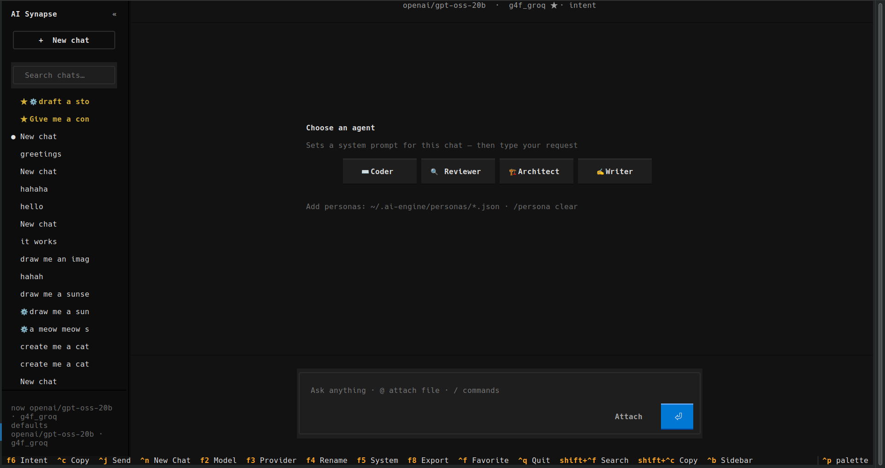

# AI Synapse

[](https://pypi.org/project/ai-synapse/)
[](https://pypi.org/project/ai-synapse/)
[](LICENSE)
[](https://github.com/mihir0209/AI_engine/actions/workflows/test.yml)

**Free multi-provider AI SDK** with drop-in OpenAI compatibility, intelligent routing across 27+ providers, automatic key rotation, and an optional local OpenAI-compatible server. Use it as a Python library, run your own API gateway, or add the terminal chat UI.

```bash
pip install ai-synapse              # SDK — routing, failover, OpenAI client
pip install ai-synapse[server]      # SDK + local OpenAI-compatible server
pip install ai-synapse[all]         # SDK + server + terminal chat (TUI)
```

**Latest:** v1.0.3 — test harness, rotation mutmut gate, httpx 0.28, docs refresh. See [CHANGELOG](CHANGELOG.md).

---

## Python SDK

Drop-in `OpenAI` client that routes across free-tier and self-hosted providers with failover, **per-provider API key rotation**, health-aware routing, and model caching.

```python
from ai_engine import OpenAI

client = OpenAI()
response = client.chat.completions.create(
    model="gpt-4",
    messages=[{"role": "user", "content": "Hello!"}],
)
print(response.choices[0].message.content)
```

**CLI** (entry point `ai-engine` or `python -m ai_engine`):

```bash
ai-engine chat "Explain quantum tunneling"
ai-engine serve --port 8000          # local OpenAI-compatible server
ai-engine providers                # list configured providers
ai-engine status                   # quick provider counts
ai-engine version
python -m ai_engine tui            # optional terminal UI
```

More examples: [`examples/sdk/`](examples/sdk/)

---

## Local server

OpenAI-compatible HTTP API on your machine — same routing engine as the SDK, plus dashboard, provider management, metrics, and chat persistence.

```bash
mkdir -p ~/.ai-engine && cp .env.example ~/.ai-engine/.env
# edit ~/.ai-engine/.env — add provider API keys

pip install ai-synapse[server]
python -m ai_engine serve
```

| Endpoint | URL |
|----------|-----|
| OpenAI API | `http://localhost:8000/v1/` |
| Universal router | `http://localhost:8000/v1/uni` |
| Swagger UI | `http://localhost:8000/docs` |
| Health | `http://localhost:8000/health` |

Point any OpenAI SDK at `base_url="http://localhost:8000/v1"`:

```python
from openai import OpenAI

client = OpenAI(base_url="http://localhost:8000/v1", api_key="dummy")
response = client.chat.completions.create(
    model="gpt-4",
    messages=[{"role": "user", "content": "Routed through AI Synapse"}],
)
```

Server docs: [API reference](docs/API.md) · [Server guide](docs/SERVER_README.md) · [Deployment](docs/DEPLOYMENT.md)

---

## Configuration

Provider API keys load in **layers**. When the same variable appears in multiple places, the **higher layer wins**.

| Priority | Source | Typical use |
|----------|--------|-------------|
| **1** (highest) | Shell / container env (`export GROQ_API_KEY=…`) | CI, Docker, secrets |
| **2** | `AI_SYNAPSE_ENV=/path/to/profile.env` | Named profiles |
| **3** | `./.env` in **current working directory** | Per-project overrides |
| **4** (lowest) | `~/.ai-engine/.env` | Global config after `pip install` |

### Global setup (pip install)

```bash
mkdir -p ~/.ai-engine
cp .env.example ~/.ai-engine/.env
# edit ~/.ai-engine/.env — GROQ_API_KEY, OPENROUTER_API_KEY, etc.
```

### Project overrides (git clone / editable install)

```bash
pip install -e ".[server]"
cp .env.example .env
python -m ai_engine serve
```

### Runtime modes (developers)

| Variable | Values | Purpose |
|----------|--------|---------|
| `AI_ENGINE_MODE` | `testing`, `live`, `all` | Filter providers (`testing` = mock harness only) |

See [`.env.example`](.env.example) and [provider keys guide](docs/collect_api.md).

---

## Terminal chat (optional)

Textual-based terminal UI — same SDK routing. Install only if you want a local chat app in the terminal.

```bash
pip install ai-synapse[tui]    # or ai-synapse[all]
python -m ai_engine tui
```



Sidebar history, model/provider routing, slash commands, `@` file attach, vision. **[docs/TUI.md](docs/TUI.md)**

---

## Documentation

| Doc | Contents |
|-----|----------|
| [API reference](docs/API.md) | HTTP endpoints (server) |
| [Server guide](docs/SERVER_README.md) | Dashboard, providers, metrics |
| [User guide](docs/USER_GUIDE.md) | Web dashboard & chat UI |
| [Architecture](docs/ARCHITECTURE.md) | Routing, failover, caching |
| [Provider keys](docs/collect_api.md) | Free-tier signup |
| [Deployment](docs/DEPLOYMENT.md) | Docker, production |
| [TUI guide](docs/TUI.md) | Terminal chat (optional) |
| [Contributing](CONTRIBUTING.md) | Dev setup, tests, mutmut gate |

---

## Development

```bash
git clone https://github.com/mihir0209/AI_engine.git
cd AI_engine
python -m venv .venv && source .venv/bin/activate
pip install -e ".[dev,server]"

# Non-live tests (mock provider on 127.0.0.1:18765 — no live API calls)
AI_ENGINE_MODE=testing pytest tests/ -m "not live" --timeout=30 -q

ruff check core tests ai_engine
```

Key rotation and server paths are covered by integration + unit tests; optional local mutation gate: `./scripts/mutmut_rotation_gate.sh 90` after `mutmut run`. Details in [CONTRIBUTING.md](CONTRIBUTING.md).

---

## License

MIT — see [LICENSE](LICENSE).