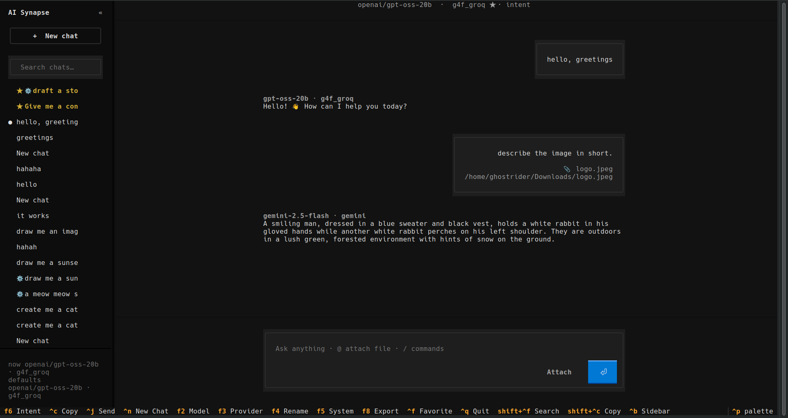

# AI Synapse

[](https://pypi.org/project/ai-synapse/)
[](https://pypi.org/project/ai-synapse/)
[](LICENSE)

**Free multi-provider AI SDK** with a terminal chat UI, drop-in OpenAI client, and optional local server. Routes across 27+ providers with failover, model caching, and intent-aware routing.

```bash
pip install ai-synapse[tui]    # recommended — SDK + terminal chat
python -m ai_engine tui
```

```bash
pip install ai-synapse         # SDK only
pip install ai-synapse[all]      # SDK + TUI + server extras
```

---

## Terminal chat


Sidebar history, model/provider routing, slash commands, `@` file attach, and collapsible sidebar. Full walkthrough, shortcuts, and all screenshots: **[docs/TUI.md](docs/TUI.md)**.

### Vision (image attach → describe)



Attach an image above the composer, ask a question, and get a vision-capable reply. Sent messages keep a **path reference** only — the pixel preview stays in the attachment strip until you send.

---

## Python SDK

```python
from ai_engine import OpenAI

client = OpenAI()
response = client.chat.completions.create(
    model="default",
    messages=[{"role": "user", "content": "Hello!"}],
)
print(response.choices[0].message.content)
```

```bash
ai-engine chat "Explain quantum tunneling"
ai-engine providers
ai-engine version
```

---

## Local server (optional)

```bash
cp .env.example .env
pip install ai-synapse[server]
python -m ai_engine serve
```

OpenAI-compatible API at `http://localhost:8000/v1/` · Swagger at `/docs`.

---

## Documentation

| Doc | Contents |
|-----|----------|
| [TUI guide](docs/TUI.md) | Screenshots, shortcuts, attachments, defaults |
| [API reference](docs/API.md) | HTTP endpoints |
| [User guide](docs/USER_GUIDE.md) | Web dashboard & chat UI |
| [Provider keys](docs/collect_api.md) | Free-tier signup |
| [Deployment](docs/DEPLOYMENT.md) | Docker, production |

---

## Development

```bash
git clone https://github.com/mihir0209/AI_engine.git
cd AI_engine
python -m venv .venv && source .venv/bin/activate
pip install -e ".[dev,all]"
pytest tests/
```

---

## License

MIT — see [LICENSE](LICENSE).