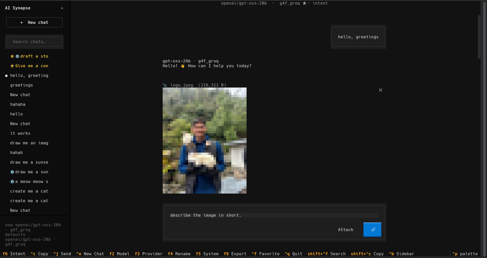

# Terminal UI (TUI)

ChatGPT-style terminal chat for AI Synapse, built with [Textual](https://textual.textualize.io/).

```bash
pip install ai-synapse[tui]
python -m ai_engine tui
```

Data is stored under `~/.ai-engine/` (chats, preferences, personas, clipboard image attachments).

### Configuration

API keys load in layers (same variable name — **higher layer wins**; different names are merged):

| Priority | Source |
|----------|--------|
| 1 (highest) | Shell exports (`export GROQ_API_KEY=…`) |
| 2 | `AI_SYNAPSE_ENV=/path/to/profile.env` |
| 3 | `./.env` in current working directory |
| 4 (lowest) | `~/.ai-engine/.env` global file |

```bash
mkdir -p ~/.ai-engine
cp .env.example ~/.ai-engine/.env   # edit with your keys
```

Optional JSON overrides: `~/.ai-engine/config.json`. Cache: `~/.ai-engine/data/`.

---

## Screenshots

### Main chat

Sidebar history, model/provider header, persona empty-state, and composer with `@` / `/` hints.


### Image selection

Use **Attach**, `@filename` fuzzy search, or paste a file path. The preview updates before you send.



### Vision reply

Send with an attached image; the model describes it. User messages show a **path reference** (not a second inline preview).


---

## Keyboard shortcuts

| Key | Action |
|-----|--------|
| `F2` | Model picker (search, favorites ☆, pagination) |
| `F3` | Provider picker |
| `F5` | System prompt |
| `F6` | Toggle intent routing |
| `F8` | Export chat |
| `Ctrl+B` | Collapse / expand sidebar |
| `Ctrl+N` | New chat |
| `Ctrl+F` | Favorite chat |
| `Ctrl+Shift+F` | Search chats |
| `Ctrl+C` / `y` | Copy when composer focused (not terminal interrupt) |
| `Ctrl+P` | Command palette |
| `Ctrl+Q` | Quit (or stop generation with `■` / `Esc` while streaming) |

While a reply is streaming, chat switching is blocked until you stop generation (`■` or `Esc`).

---

## Composer

| Input | Action |
|-------|--------|
| `@partial` | Fuzzy file attach picker |
| `/read` | Load file into composer (fuzzy picker) |
| `/defaults` | Save current model & provider as defaults |
| `/defaults clear` | Restore saved defaults |
| `/help` | Full command list |

Type `/` for slash-command suggestions.

---

## Attachments

- **File path** — stored as `_image_path` in chat JSON; shown as `📎 filename` + path in the user bubble.
- **Clipboard paste** — copied into `~/.ai-engine/attachments/` so the path survives the session.
- **Vision** — image bytes are sent to vision-capable models on the next request (20 MB max per image).
- **Text files** — `@file` or the file picker injects `.py`, `.md`, and other non-image files as code blocks in the composer.

### Security note

`@attach`, `/read`, and the file picker can read **any file your user account can open** on disk (including `~/.ssh`, env files, etc.). Content you load is sent to remote LLM providers on the next message. Use only in trusted environments; avoid attaching secrets.

---

## Defaults

Sidebar footer shows active and saved defaults:

```
now <model> · <provider>
defaults <model> · <provider>
```

`/clear` (new chat) and `/defaults clear` restore the saved default model and provider.